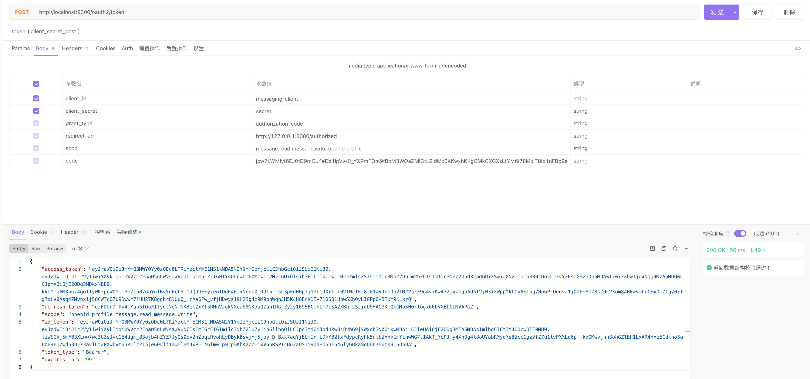
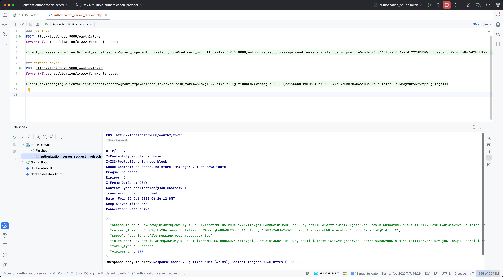

- get grant_code

open in browser：http://127.0.0.1:9000/oauth2/authorize?response_type=code&client_id=messaging-client&scope=message.read%20message.write%20openid%20profile&redirect_uri=http://127.0.0.1:8080/authorized&state=

- get token

[source,bash]
----
curl --location --request POST 'http://localhost:9000/oauth2/token' \
--data-urlencode 'client_id=messaging-client' \
--data-urlencode 'client_secret=secret' \
--data-urlencode 'grant_type=authorization_code' \
--data-urlencode 'redirect_uri=http://127.0.0.1:8080/authorized' \
--data-urlencode 'scop=message.read message.write openid profile' \
--data-urlencode 'code=4FxAZJYuYoSyRLZXb-EKJu5jL5w9eJuAqi-JPAyapfajheUENv5GLIOR8DoHvnuB0lWbsSjrurmXYNmHeKj1YnhLXEVR23FCxNtvKyrRqER1HZQM5JSlsvkjwKb2drNw'
----

[source,http]
----
### get token
POST http://localhost:9000/oauth2/token
Content-Type: application/x-www-form-urlencoded

client_id=messaging-client&client_secret=secret&grant_type=authorization_code&redirect_uri=http://127.0.0.1:8080/authorized&scop=message.read message.write openid profile&code=v4h0A4FlCm7H0r3aaIdl7YXWRHQWaiKFUzeUGJbLGVEniTsU-Z6RS4HUtZ-bhd1QZG4N4VaIOK9y-tLQGEkSqNFI7HOAx7kMYyb6JqemSobMEcBmvI7WirizInZpukn2

----
image::doc/img/get_token_http.png[]

- refresh token

[source,http]
----
### refresh token
POST http://localhost:9000/oauth2/token
Content-Type: application/x-www-form-urlencoded

client_id=messaging-client&client_secret=secret&grant_type=refresh_token&refresh_token=5Em2gIFv7BeimaupI5EjIz1NNGFdZ4Wd6mijFwBMuQFCQoo15WWh8fPdEQn3lRNX-XuUJ4Yn0VYGnbZR3CA5YDGsSL6Eh8fwIncuFz-RMojV0P5675kqhs0jCldjzITX

----

